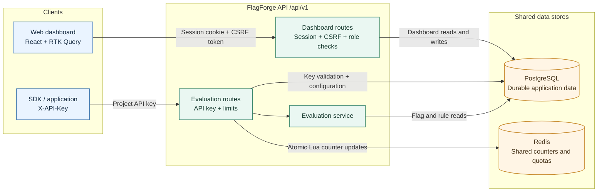
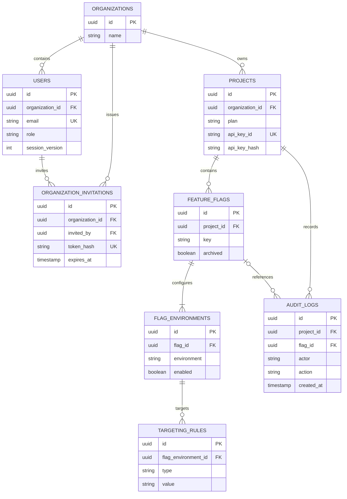

# FlagForge System Design

## Scope

This document describes the current FlagForge implementation: a multi-tenant feature-flag dashboard and API, with PostgreSQL as the source of truth and Redis for distributed evaluation limits. Recommendations for future scaling are marked separately from implemented behavior.

## Requirements

- Manage organizations, members, projects, feature flags, environments, targeting rules, and audit history.
- Evaluate one or multiple flags for a project and environment using an API key.
- Isolate dashboard data by organization and evaluation data by project.
- Apply shared per-project rate limits and a monthly evaluation quota across API instances.
- Keep flag evaluation synchronous and return its result directly to the caller.

## High-Level Architecture

The React and TypeScript client uses React Router and Redux Toolkit Query. The Node.js and Express API owns authentication, authorization, validation, business logic, evaluation, and persistence. PostgreSQL stores durable application data. Redis stores expiring counters shared among API processes. There is no message queue or evaluation-result cache in the current implementation.

## Main Components

| Component | Responsibility |
| --- | --- |
| React dashboard | Registration, login, project and flag management, rules, team management, audit views. API calls include credentials and the CSRF token. |
| Express API | Versioned REST API, request parsing, CORS and security headers, auth middleware, role checks, validation, controller and service execution. |
| PostgreSQL | Organizations, users, invitations, projects, API key hashes, flags, per-environment state, targeting rules, and audit logs. |
| Redis | Atomic per-project sliding-window request counters and monthly per-project and organization-wide evaluation quota counters, implemented with Redis Lua scripts. |
| Application/SDK clients | Submit individual or batch evaluations using the project's `X-API-Key`. |

At startup, the API connects to Redis, runs the database migration SQL, then starts listening. If either dependency or migration fails, the process does not start. The `/health` endpoint reports API process health; it does not independently probe both dependencies.

## Design Decisions and Trade-Offs

These rationales describe the properties and trade-offs of the current design; the repository does not record a formal decision history.

| Decision | Rationale | Trade-off |
| --- | --- | --- |
| PostgreSQL is the source of truth | Organizations, memberships, projects, flags, environments, rules, and audit records have relational ownership and integrity requirements. Transactions keep related mutations, such as flag creation and its environment rows, consistent. | Evaluation performs database reads on its request path, so database latency and capacity directly affect evaluation throughput. |
| Redis is shared for evaluation limits | All API instances need to observe the same per-project request counts and monthly usage across projects in an organization. Redis Lua scripts atomically check and increment both project and organization quota counters. | Redis is an additional required dependency for API startup and evaluation. Redis failures affect evaluation availability. |
| Dashboard sessions and project API keys are separate credentials | Browser users authenticate as organization members; SDK clients authenticate as a project. This gives each API surface a clear identity and authorization scope. | Two authentication flows and their lifecycle controls must be maintained. |
| Store API key identifiers and hashes, not raw keys | The identifier locates a project record, and comparing the submitted key to a stored bcrypt hash avoids storing a reusable secret in plaintext. | Bcrypt verification adds CPU work to each API-key-authenticated request. |
| Store environment state as related rows | A flag's development, staging, and production states and targeting rules are managed independently. Relational rows keep rules scoped to one flag environment. | Evaluation performs database lookups and joins rather than reading one denormalized flag document. |
| Evaluate synchronously from current database configuration | The caller receives a direct result, and flag changes do not require a cache invalidation or asynchronous propagation mechanism. | Each evaluation queries PostgreSQL; the batch endpoint fans out work with `Promise.all`, so concurrency and database capacity need monitoring. |
| Resolve evaluation limits from project plans | Project API-key authentication loads the project's plan, and centralized plan configuration supplies individual request, batch request, per-project monthly evaluation, and organization-wide monthly evaluation limits. The `standard` plan allows 60 individual requests/minute, 10 batch requests/minute, 10,000 evaluations per project/month, and 50,000 evaluations per organization/month. | Only the `standard` plan is currently defined, so all projects have the same entitlements until additional plans and their values are configured. The batch payload allows up to 50 flag keys, each counted against both monthly quotas. |
| Write audit records with configuration changes | Audit entries provide actor, role, action, and payload context for flag changes. Writes use the same database transaction as the corresponding mutation. | Audit data adds storage and write work; the current schema has no retention or archival policy. |

## Data Model

**Core data model. See `migrate.ts` for the complete schema and constraints.**
- **Organization** is the tenant boundary for dashboard users and projects.
- **User** belongs to one organization and has an `owner`, `admin`, or `member` role. Email is globally unique.
- **Organization invitation** stores a hashed invitation token, role, expiration, acceptance time, and inviter.
- **Project** belongs to an organization, has a plan that determines its evaluation entitlements, and stores an API key identifier plus a bcrypt hash. The raw API key is returned only on creation or rotation.
- **Feature flag** belongs to a project and has a unique key within that project.
- **Flag environment** stores enabled state for `development`, `staging`, or `production`. Flag creation creates one row for each environment.
- **Targeting rule** belongs to an environment and stores a rule type (`user_ids`, `groups`, or `percentage`) and serialized value.
- **Audit log** records flag-related changes, actor, role, action, and payload. It keeps project/key/name snapshots; deleting a flag nulls its flag reference, while deleting the project cascades to its audit records.

Foreign keys and uniqueness constraints enforce core relationships. Indexes support organization/project/flag lookups, rule retrieval, and recent audit queries. Migrations are currently idempotent SQL run at API startup rather than a versioned migration history.

## Role-Based Access Control (RBAC)

Dashboard authorization uses the user's organization membership and one of three roles: `owner`, `admin`, or `member`. Authentication establishes the user identity; route middleware enforces role permissions, while controllers scope data access to the authenticated user's organization.

| Capability | Owner | Admin | Member |
| --- | --- | --- | --- |
| View projects, flags, statistics, and audit data | Yes | Yes | Yes |
| Create, update, or delete projects; rotate or revoke project API keys | Yes | Yes | No |
| Create, update, archive, or delete flags; toggle environments; manage targeting rules | Yes | Yes | No |
| Create invitations and list organization members | Yes | Yes | No |
| Remove a member | Yes, except self or an owner | Yes, except self, an owner, or another admin | No |

New organizations are created with an owner. Owners and admins can invite users as admins or members; invitation acceptance creates the account with the role encoded in that invitation. Owner assignment is not available through invitations. The API loads the user's current role from PostgreSQL during session authentication, so authorization does not rely solely on a role value in the JWT.

## Request Flows

### Dashboard request

1. The browser calls `/api/v1` with the HTTP-only `ff_session` cookie. Mutating requests also include `X-CSRF-Token`.
2. `requireAuth` verifies the JWT, checks the user's current `session_version` and role in PostgreSQL, and attaches the current user context.
3. `csrfProtection` validates origin and token for cookie-authenticated mutations. `requireRole` protects owner/admin-only operations.
4. The controller validates input, checks organization ownership, performs database work, and writes audit events for flag changes.
5. The API returns JSON; RTK Query manages client requests and cache state.

Sessions are JWTs in HTTP-only, same-site cookies with a one-hour lifetime. Logout increments the stored session version, invalidating the current token.

### Flag evaluation request

1. The caller submits `POST /api/v1/evaluate` or `/api/v1/evaluate/batch` with `X-API-Key` and an environment, plus optional user ID and groups.
2. API-key middleware retrieves the project by key ID and verifies the full key against its bcrypt hash. The project ID from the key becomes the evaluation scope; a supplied `projectId` must match it.
3. API-key authentication loads the project's organization ID and plan. Redis enforces that plan's per-project HTTP request limits for `/evaluate` and `/evaluate/batch`; these limits count requests, not flags inside a batch. A weighted sliding window smooths capacity across minute boundaries.
4. Separately, each batch request may contain up to 50 flag keys. Each key counts as one evaluation against both a 10,000-per-project monthly quota and a shared 50,000-per-organization monthly quota under the `standard` plan. Redis checks and increments both counters atomically; usage headers report remaining quota at both scopes.
5. The evaluation service reads the flag and environment state from PostgreSQL, then reads targeting rules if the flag is active. It returns an enabled value and a reason, including `FLAG_NOT_FOUND`, `FLAG_ARCHIVED`, `ENVIRONMENT_DISABLED`, or a targeting result.
6. Batch evaluation runs the individual evaluations concurrently with `Promise.all` and returns one result per input flag key.

The targeting rules are read in creation order. User ID and group rules match by membership; percentage rules use a deterministic user-ID hash when a user ID is present. Without a user ID, percentage rollout uses a random value, so repeated requests are not guaranteed to get the same result.

## API Surface

All routes are rooted at `/api/v1`.

| Route group | Authentication | Purpose |
| --- | --- | --- |
| `/auth` | Public endpoints; session-aware lookup/logout | Registration, login, logout, session lookup, invitation acceptance. |
| `/organizations` | Dashboard session; owner/admin for management | Invite, list, and remove organization members. |
| `/projects` | Dashboard session; owner/admin for mutations | List, create, update, delete projects; rotate or revoke API keys. |
| `/flags` | Dashboard session; owner/admin for mutations | Manage flags, environments, and targeting rules; inspect flag audit history. |
| `/stats`, `/audit` | Dashboard session | Dashboard metrics and organization audit history. |
| `/evaluate`, `/evaluate/batch` | Project API key | 60 individual requests/minute; 10 batch requests/minute; 10,000 evaluations/project/month and 50,000 evaluations/organization/month. Each batch request accepts up to 50 flag keys. |

## Security and Tenant Isolation

- Passwords and project API keys are bcrypt-hashed; invitation tokens are stored as hashes.
- Dashboard authorization derives organization and role from the current database user record, rather than trusting those claims alone from the JWT.
- Project and flag queries validate organization ownership. Evaluation requests are scoped to the project identified by the API key.
- Cookie-authenticated state changes require CSRF validation. Helmet and configured CORS are enabled at the API boundary.
- Request bodies are size-limited; evaluation payloads use a 64 KB limit and other JSON payloads use a 1 MB limit.
- Secrets and connection strings are environment-configured. `JWT_SECRET` is required and must be at least 32 characters.

## Reliability and Scaling

### Current behavior

- API processes can share PostgreSQL and Redis. Redis Lua scripts make each multi-command counter operation atomic across processes.
- Evaluation reads are synchronous and query PostgreSQL for every flag. An active flag may require a flag/environment query plus a targeting-rules query.
- The controller accepts up to 50 flag keys and dispatches their evaluation promises with `Promise.all`. PostgreSQL access is bounded by the 20-connection pool per API process, so the accepted batch size does not mean 50 database operations run at once.
- The PostgreSQL pool is capped at 20 connections per API process. Total possible database connections therefore grow with the number of API replicas.
- Redis is required for startup and evaluation limiting. PostgreSQL is required for startup, dashboard operations, and evaluation.

### Scaling considerations

- Load-test evaluation latency and database connection pressure, especially for full batches and concurrent clients.
- If database reads become the bottleneck, consider a versioned per-project/environment configuration snapshot or cache. Define invalidation behavior for flag, environment, and rule mutations before enabling it.
- Bound batch concurrency rather than launching every flag evaluation at once if database capacity requires it.
- Tune per-instance PostgreSQL pool sizes against the database connection budget before adding API replicas.
- Add dependency-aware readiness checks, structured request metrics, and alerting for Redis/PostgreSQL failures and quota rejections for production operation.

## Deployment Shape

The Docker Compose setup runs four separate containers: PostgreSQL 15, Redis 7, the Express backend, and the React dashboard. PostgreSQL and Redis data are persisted in named Docker volumes, and their ports are bound to loopback for local development access. The dashboard is served by Nginx and proxies API requests to the backend. TLS termination, backups, and multi-region topology are deployment decisions outside the current repository configuration.